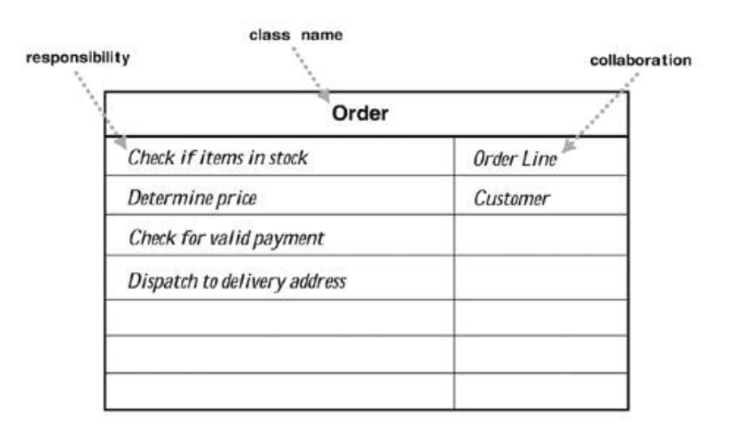

# Cell Society Design Lab Discussion
#### Matthew Giglio (mcg69), Saad Lahrichi(sl636), Luka Mdivani(lm378)


### Simulations

* Commonalities
    * All of them operate in grids
    * Each cell in a grid has an "on" or "off" state


* Variations
    * The formations of cells in each variation are formed given different rules
    *


### Discussion Questions

* How does a Cell know what rules to apply for its simulation?
    * If each game has its own `update()` implemenatation given that some `Simulation` class is extended variation to variation, then a cell should know how to update.

* How does a Cell know about its neighbors?
    * We can store every cell in a 2d array representing the grid. Depending on its location, each cell would have 2-8 neighbors that can be accessed using the index of the current cell +- 1 row/column/diagonal.

* How can a Cell update itself without affecting its neighbors update?
    * if we store the cell in a 2d data structure each cell can be updated according to its index. The ways in which each cell updates, and cells which need to be updated can be determined in the `update()` method.
* What behaviors does the Grid itself have?
    * The Grid would (1) show its current state, (2) update itself, (3) adding/removing cells.

* How can a Grid update all the Cells it contains?
    * Iterate through the grid and call a method on each individual cell

* What information about a simulation needs to be in the configuration file?
    * The simulation type
    * values specific to the simulation (probability)
    * size of grid

* How is configuration information used to set up a simulation?
    * The Grid should read the xml file and set up the simulation according to the rules specified in the file. The file in a given class should correspond to the proper simulation (ex: gameOfLife.xml should be read in the gameOfLife.java class)


* How is the graphical view of the simulation updated after all the cells have been updated?
    * We could update each existing cell.


### Alternate Designs

#### Design Idea #1

* Data Structure #1 and File Format #1
    * Have a 2D array that stores cells that are updated accordingly
    * Have an XML file to read the configuration of each Simulation.
* Data Structure #2 and File Format #2
    * Have a `Cell` class that the grid holds, and each cell can be updated front-end and back-end wise given what happens in the game
    * XML file could have effect on the color/size/attributes of a cell


#### Design Idea #2

* Data Structure #1 and File Format #1
    * Have a Map which stores cells and updates them on each step.
    * Use an XML

* Data Structure #2 and File Format #2


### High Level Design Goals


### CRC Card Classes

This class's purpose or value is to represent a customer's order:



This class's purpose or value is to represent a customer's order:

|Order| |
|---|---|
|boolean isInStock(OrderLine)         |OrderLine|
|double getTotalPrice(OrderLine)      |Customer|
|boolean isValidPayment (Customer)    | |
|void deliverTo (OrderLine, Customer) | |


This class's purpose or value is to represent a customer's order:
```java
public class Order {
     // returns whether or not the given items are available to order
     public boolean isInStock (OrderLine items)
     // sums the price of all the given items
     public double getTotalPrice (OrderLine items)
     // returns whether or not the customer's payment is valid
     public boolean isValidPayment (Customer customer)
     // dispatches the items to be ordered to the customer's selected address
     public void deliverTo (OrderLine items, Customer customer)
 }
 ```


This class's purpose or value is to manage something:
```java
public class Something {
     // sums the numbers in the given data
     public int getTotal (Collection<Integer> data)
	 // creates an order from the given data
     public Order makeOrder (String structuredData)
 }
```


### Use Cases

* Apply the rules to a middle cell: set the next state of a cell to dead by counting its number of neighbors using the Game of Life rules for a cell in the middle (i.e., with all its neighbors)
```java
 Something thing = new Something();
 Order o = thing.makeOrder("coffee,large,black");
 o.update(13);
```

* Apply the rules to an edge cell: set the next state of a cell to live by counting its number of neighbors using the Game of Life rules for a cell on the edge (i.e., with some of its neighbors missing)
```java
 Something thing = new Something();
 Order o = thing.makeOrder("coffee,large,black");
 o.update(13);
```

* Move to the next generation: update all cells in a simulation from their current state to their next state and display the result graphically
```java
 Something thing = new Something();
 Order o = thing.makeOrder("coffee,large,black");
 o.update(13);
```

* Set a simulation parameter: set the value of a parameter, probCatch, for a simulation, Fire, based on the value given in a data file
```java
 Something thing = new Something();
 Order o = thing.makeOrder("coffee,large,black");
 o.update(13);
```

* Switch simulations: load a new simulation from a data file, replacing the current running simulation with the newly loaded one
```java
 Something thing = new Something();
 Order o = thing.makeOrder("coffee,large,black");
 o.update(13);
```