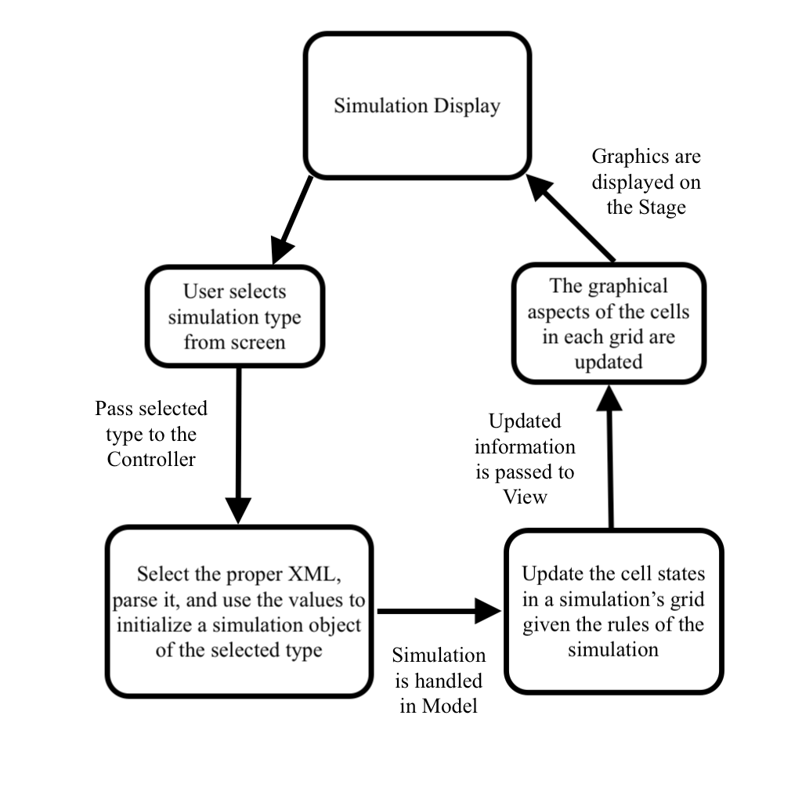
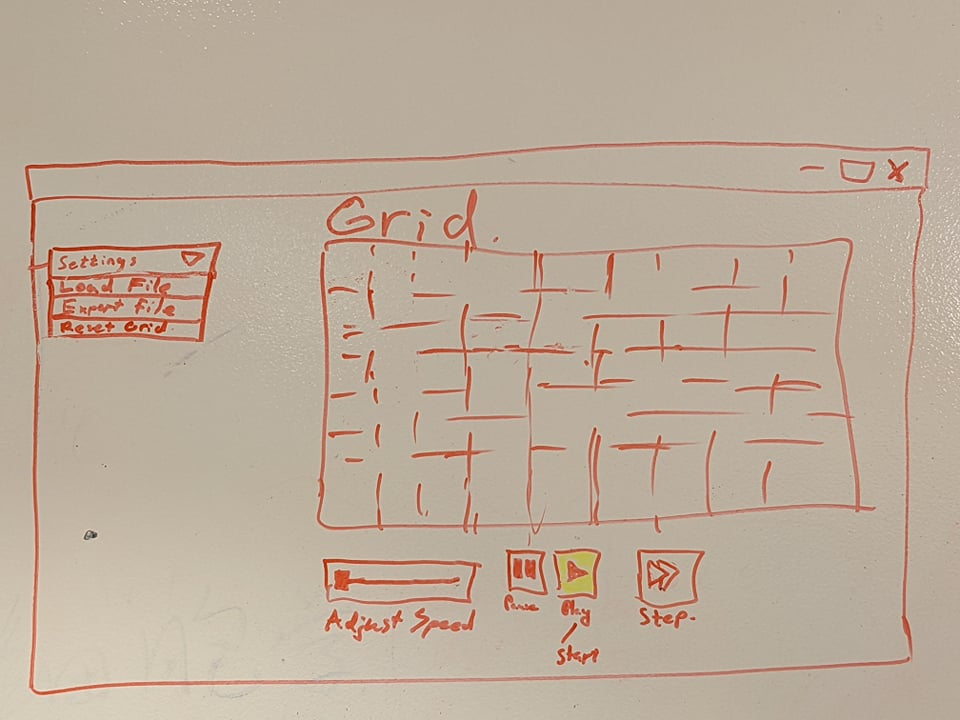

# Cell Society Design Plan
### Team 2
### Matthew Giglio, Saad Lahrichi, and Luka Mdivani


## Design Overview
The overall design will consist of three general areas: the model, the view, and the controller. The model will handle the backend portion of updating states and values throughout a simulation, and the view will render the graphics displaying the progress of the simulation. As the parameter values for each simulation must be determined by an XML file, the controller will handle file parsing and the logic of determining which specific simulation should be displayed.

To enable efficient implementation and to allow for flexibility in terms of features or extensions, the design will leverage inheritance - particularly in the model - to take advantage of the similarities between the various simulations. All simulations involve a grid and cells, so abstract `Grid` and `Cell` classes will serve as superclasses to extensions of different grid and cell shapes for each specific simulation. Each simulation will need its own class because the logic by which each simulation progresses and updates is different, so a general `Simulation` class will also act as a superclass. If the simulation, grid, and cell logic are all managed abstractly, then the viewer can be designed generically and work with the superclasses, allowing the graphical rendering process to be the same for all simulations. 

While the view will not need to implement its own superclasses since it will utilize the abstractions created by the model, the way in which different simulations will be chosen will be a fundamental part of the controller. The controller will have to handle a user input, and given that user input, it will have to create a particular `Simulation` implementation and build it from the values prescribed in the XML file. 


## Design Details



### Controller

The Controller's main tasks will be to interpret user input and send that information to the Model. Such 
information will determine the type of simulation. The Controller would manage 7 classes: `GeneralController`, `XMLParser`, and 
one class for each Simulation (Game Of Life, Spreading Fire...). 
The `GeneralController` class would collect user input and use passed paramters to create a new Simulation object (e.g. `GameOfLife`) .
To do so, it would have to call the `XMLParser` to read the corresponding XML file and return the GameOfLife map with specified parameters to the `GeneralController`, which would 
also serve as the bridge between the `Controller` and the `Model`. After the map is returned, the `Model` would then process it before it is passed to the `View`.

### Model

The model will manage 3 abstract classes - `Simulation`, `Grid`, and `Cell` - and extensions of each of them for the 5 different simulations. The `Simulation` class will have instance variables including a `Grid`, the `numberOfRows`, the `numberOfColumns`, and the `numberOfCells`. To initialize the simulation, the class will need to have calls to `createGrid()` and `populateCells()` in its constructor. The purpose of `Simulation.java` is to manage the backend resources of a given simulation, so although it will have `step(double elapsedTime)` and `updateCells()` methods to update the state of the simulation elements over time, none of the processes will directly alter the graphics. For the abstract class, many of these methods will be also be abstract and instead be implemented in each specific variation of the simulation: different simulations update their cells with different logic, so they cannot share the same methods.

The `Grid` class will take in the number of cells, rows, and columns from the simulation class and create a `Cell[][]` to represent the grid itself. Although the simulation will iterate over the grid to determine cells which need to be updated, the `Grid` class will have internal method to update its own values as opposed to being handled in `Simulation.java`. Additionally, the `Cell` class will store attributes such as a `Shape`, size, color, and a dead-or-alive value, and it will also be able to actively update its own values. 

### View

The task of the View will be to create and manage a graphical user interface for the simulation. 
It will have a main Class `SimulationViewer()`. At first, it will take information from the controller which has parsed the XML file, it will draw the 
starting grid along with all the necessary menu buttons needed for loading files, and playing the animation. It will use the relevant controller class to
load a new grid configuration when needed. The main animation loop for the simulation will run in this class, and it'll have 
methods to pause,play,increase speed and change the simulation by one-step increments. 
On each step it will work with the `Simulation(`) class
to get information about the new state of the grid according to the current simulation logic and display
it on the screen using the `updateView()` method. 
There will be a class for drawing the grid called `gridVisulazier()` . it will arrange the cells into the
grid and make the nodes ready to display. if the grid has different shapes, there will be several subclasses
,according to shapes,which will extend the main `gridVisulazier()` class.

## XML File Formatting

The XML files will treat the simulation as an attribute and will be able to differentiate given that the type of simulation will be stored as a child element. As a simple example, the percolation simulation is shown below with some of its attributes:

```xml
<data simulation="simulation">
  <type>percolation</type>
  <numberOfColumns>10</numberOfColumns>
  <numberOfCells>100</numberOfCells>
  <numberOfRows>10</numberOfRows>
</data>
```

When a simulation has a parameter specific to itself, such as the spreading fire simulation's `probCatch`, it will be another child in the file: 

```xml
<data simulation="simulation">
  <type>spreadingfire</type>
  <numberOfColumns>10</numberOfColumns>
  <numberOfCells>100</numberOfCells>
  <numberOfRows>10</numberOfRows>
  <probCatch>.5</probCatch>
</data>
```
## Use Cases

 * Team generated Use Case
 ```java
 Something thing = new Something();
 Order o = thing.makeOrder("coffee,large,black");
 o.update(13);
 ```
   * Luka:
     1. *User wants to pause simulation*
        ```java
        //in SimulationViewer
        EventHandler(event){
        if(event pause button pushed){pauseSimulation()}
        }
        pauseSimulation(){
        prevent calling the step() function until pause button hit again
        }
        
        ```
     2. *user wants to export current grid state*
         ```java
        //in SimulationViewer
        
        EventHandler(event)
        if(event is export)
          controller.writeToXML()
        ```

* Saad:
    1. *Reverse simulation*
       ```java
       //in SimulationViewer
       EventHandler(event){
       if(event reverse button pushed){reverseSimulation()}
       }
       reverseSimulation(){
       play the simulation backwards
       }
       
       ```
       
    2. *Reset Simulation*
        ```java
       //in SimulationViewer
       EventHandler(event){
       if(event reset button pushed){resetSimulation()}
       }
       resetSimulation(){
       pauseSimulation();
       newSimulaton=Controller.loadFile(curentXML);
       updateView();
       }
       
       ```
    
   * Provided Scenario Use cases
      * *Switch simulations:*
         ```java
             //in SimulationViewer()
             pauseSimulation();
             newSimulation=Controller.loadFile("name.xml");
             updateView(); 
        ```
      * *Move to the next generation:*
         ```java
             //in SimulationViewer() game loop
             Simulation.step();
             updateView();
        ```
* Matthew
  * Move to the next generation: update all cells in a simulation from their current state to their next state and display the result graphically:
  In `Simulation.java`:

  ```java
  private void step(double elapsedTime) {
    myGrid.update()
  }
  ```

  In the `Grid` class:
  ```java
  private void update() {
    for (Cell cell : myCollectionOfCells) {
      if (theCellShouldBeMutated) {
        cell.updateValues();
      }
    }
  }
  ```

  After the `Cell` class handles the value change, the View classes can make the graphical appearance:

  ```java
  private void updateAppearance() {
    for (Cell cell : myCollectionOfCells) {
      if (cell.isAlive()) {
        cell.updateFill();
      }
  }

  ```
  * Set a simulation parameter: set the value of a parameter, probCatch, for a simulation, Fire, based on the value given in a data file
    - As shown above, each XML file will have the value there, so in `Controller.java`, the values will be entered into the simulation object:
  ```java
  private void selectSimulation() {
    if (type == spreadingFire) {
      xmlParser.parseValues();
      SpreadingFire sp = new SpreadingFire(numberOfRows, numberOfColumns, numberOfCells, probCatch);
    }
  }
  ```

  The `SpreadingFire` class will be written as an extension of `Simulation`, so it does not have to have the same number of parameters
## Design Considerations

#### Cell color visualization

 * Have a method in `SimulationViewer()` which determines cell color according to
the cell state value, which was determined in the `Simulation()`. Or have a map of values
and color as a final variable in `SimulationViewer()`.

 * Have a color attribute for each cell, which will store and be updated with the color information
durning the simulation process. The info would then be passed to `SimulationViewer()`.

 * It would be more convinient and easy to build upon in the future to give Cells color values. 


#### Design Issue #2 - Using a 2D-array to represent the grid

* While the initial simulations all have grid shapes, the array implementation does not lend itself 
to flexible implementations with cases such as circular or triangular screens

* Alernative #1 - Use a `Map<Coordinate, Cell>`
  * Any graph can be represented with a map, so the nodes could be stored in the map with a
  correspondence between location and the `Cell` itself

* Alernative #2 - Use a `List<List<Cell>>`
  * Each row of the screen could be represented by a list of cells, and all the rows together 
  would form the collective appearance of the simulation. Having null `Cell` objects in the lists
  would allow for a difference in width (ie shape) for that row

* Trade-offs
  * The map implementation will require a little more effort than a grid would, but having the map
  provides a more flexible and abstract implementation than an array system
  * The list implementation would allow for more flexibility than a 2D array, but the system lacks
  efficiency in terms of conciseness compared to a map


## User Interface

The user interface will consist of several parts.
1. The main attribute of the GUI will be the Grid, which will consist of cells and will visualize
the simulation process.
2. There will be a dropdown settings Menu , which will give you options to Load a new XML file according
to user selection, reset the grid to the starting settings of the current model,and export the current configuration of the simulation.
3. There will also be buttons for playing and pausing the animation, as well as progressing by only one step.
There will probably also be a slider bar, which will let you adjust the speed of the animation.

**Here is a model of our planned GUI:**




## Team Responsibilities

 * Team Member #1 - Matthew
    - Handling the model aspect of the project
    - Keep teammates in the loop about model updates so view and controller can be implemented accordingly 

 * Team Member #2 - Luka
    - Will work mainly on the visualization part of the project
    - Will closely communicate with both Saad and Matthew because the visualizer is closely
   connected to both of the modelling and controller aspects. Will provide help if needed in either section.
   

 * Team Member #3 - Saad
    - Writing XML configuration files and XML file parser
    - Ensuring connection to backend is well-handled 


#### Proposed Schedule
Monday: Team meeting to discuss first steps and get started.
Wednesday: get basic methods of Controller, Model, View working, make sure they work well together.
Friday: Team meeting to discuss progress, plan for weekend.
Sunday: deliver working basic version. 